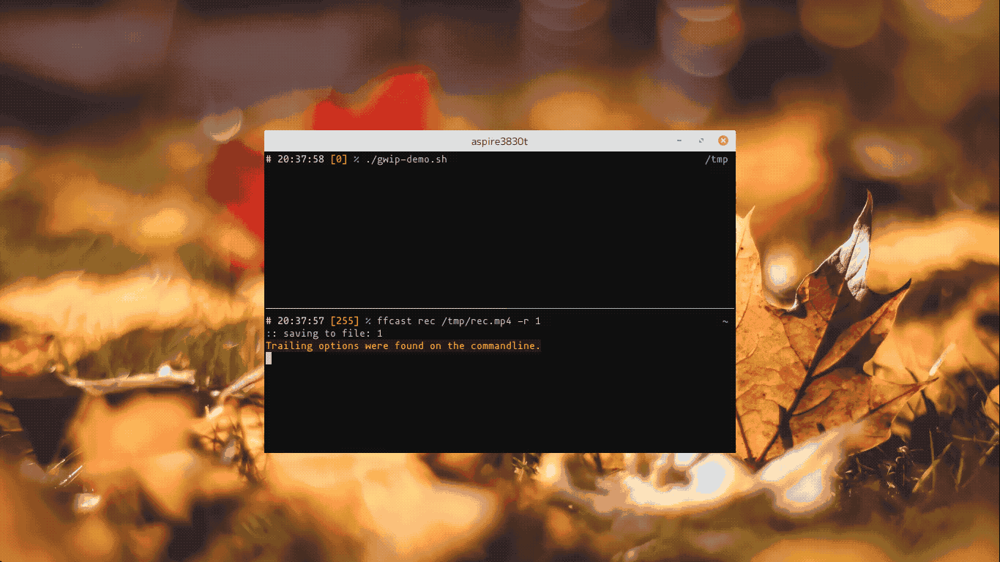

# gwip

Gridded Window Placer

A wrapper command to place the focused window to the center of
the specified cell of gridded display.

## Demo



## Installation

```
$ cargo install --git 'https://github.com/HKey/gwip.git'
```

## Usage

```
Gridded Window Placer

Usage:
    gwip move --grid=<NROWSxNCOLUMNS> --place=<ROW,COLUMN> [options]
    gwip -h | --help

Options:
    -h, --help               Show this screen.
    --grid=<NROWSxNCOLUMNS>  How to divide screen.
                             Example: "--grid=2x1"
    --place=<ROW,COLUMN>     Where move the focused window to.
                             Example: "--place=0,0"
    --fill                   Resize the window to fill the cell where the
                             the window will be moved to.
    --gap=<WIDTHxHEIGHT>     For "--fill", do not fill each edge of the
                             window.  WIDTH is a width of left and right edge.
                             HEIGHT is a height of top and bottom edge.
                             WIDTH and HEIGHT is a number or a percentage.
                             A number means the number of pixels, a percentage
                             means the percentage of the desktop width
                             or height.
    --ignore-decoration      Ignore window decoration for calcurating
                             the window size and the window position.
                             If this opton is set, xprop is not necessary
                             to run gwip.
    --xdotool=<cmd>          Command of xdotool. [default: xdotool]
    --xwininfo=<cmd>         Command of xwininfo. [default: xwininfo]
    --xprop=<cmd>            Command of xprop. [default: xprop]

Commands:
    move
        Move the focused window to the specified place.
        The display is divided into grid by "--grid" parameter.
        The window will be moved to the center of the cell in the grid
        specified by "--place" parameter.
        The row and the column of a cell is counted from top left
        and zero based.

        Example:
            $ gwip move --grid=2x3 --place=0,1

                            ncolumns = 3
                      |-----------------------|

                   -  +-------+-------+-------+
                   |  |  0,0  |  0,1  |  0,2  |
                   |  |       | here! |       |
         nrows = 2 |  |-------+-------+-------|
                   |  |  1,0  |  1,1  |  1,2  |
                   |  |       |       |       |
                   -  +-------+-------+-------+
```

## Dependency

This command depends on following commands:
- [xdotool](https://www.semicomplete.com/projects/xdotool/)
- [xwininfo](https://gitlab.freedesktop.org/xorg/app/xwininfo)
- [xprop](https://gitlab.freedesktop.org/xorg/app/xprop)

## Frequently Asked Questions

### Does Not Work on XMonad ([#1](https://github.com/HKey/gwip/issues/1))

Please use [XMonad.Hooks.EwmhDesktops](http://hackage.haskell.org/package/xmonad-contrib-0.16/docs/XMonad-Hooks-EwmhDesktops.html) in your xmonad configuration.  
That is needed to run `xdotool` properly.
`xdotool` is called from gwip internaly.

## TODO

- Support multiple display
